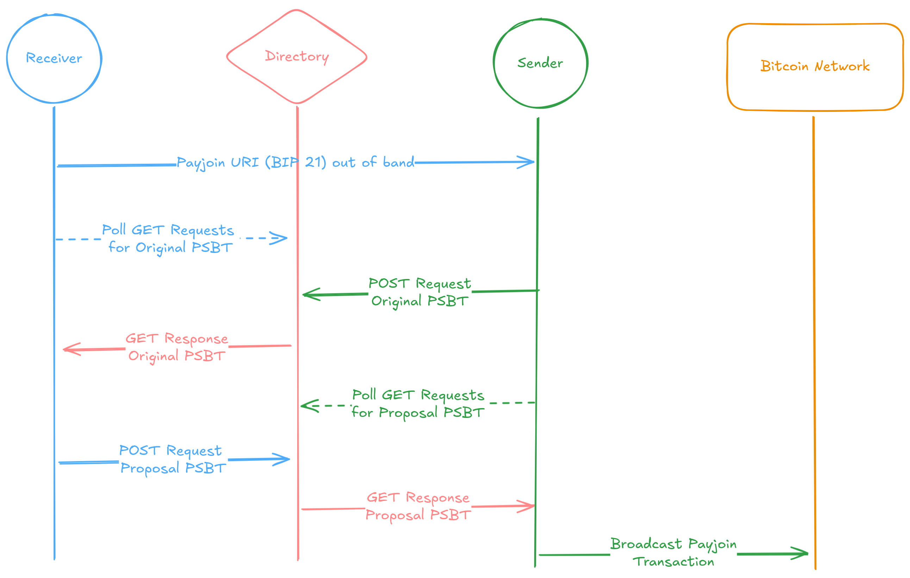
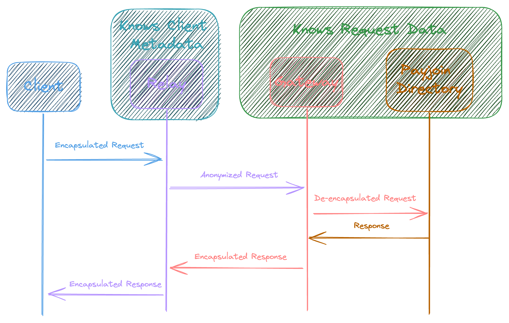

:::note

BIP 77 is still a draft BIP. Use at your own risk!

:::

### Motivation

Payjoin version 2 ([BIP 77](https://github.com/bitcoin/bips/blob/bc3123e1dab1c5b08d6f934b11b4d741107ac386/bip-0077.mediawiki)) is a draft BIP designed to improve on the limitations of version 1. In version 1, a receiver was required to host a server from which to receive requests from a sender as well as to modify the **Original PSBT** from the sender into a **Payjoin PSBT**.

Payjoin v2 eliminates this receiver requirement by outsourcing the server hosting to an untrusted third party. This "Payjoin Directory" server is dead simple and has one task — store pending payments from the sender, and forward them to and from the receiver when the other party comes back online. These Payjoin payloads are small, ephemeral, and encrypted, so a malicious directory cannot snoop on or forge message contents.

To make this work, in lieu of hosting a server themselves, the receiver starts a session assigned a _subdirectory_ which will store and forward the encrypted payjoin payloads between the sender and receiver.

That's all well and good, but what about the IP address metadata being sent to the payjoin directory? After all, even if the untrusted directory couldn't see the plaintext transaction data, couldn't it see the sender and receiver's IP addresses? Without further protection yes it could, but Payjoin v2 makes use of a novel protocol called [Oblivious HTTP](https://www.fastly.com/blog/enabling-privacy-on-the-internet-with-oblivious-http) (OHTTP) to strip client-identifying metadata from the request before it reaches the directory.

Aside from these two changes in the means of communicating the transaction, the v2 protocol takes on the same shape as v1, and is even backwards-compatible.

Payjoin v2 removes barriers to adoption by eliminating the need for the sender and receiver to be online at the same time, or for either to ever run any servers themselves.

### Protocol

:::info

All requests made to the directory by the sender or receiver are done using OHTTP, so that the directory doesn't know any of their identifying metadata. OHTTP is explained below.

:::

At a high level (and omitting some important detail), a Payjoin v2 transaction takes the following steps:

- **Receiver**: Sends their payjoin session pubkey to the directory to initialize a session at a new subdirectory.
- **Receiver**: Out of band, the receiver shares a [Bitcoin URI](https://github.com/bitcoin/bips/blob/master/bip-0021.mediawiki) with the sender including a `pj` query parameter itself containing an HTTP URL to the subdirectory. The `pj` URL fragment includes an `ohttp` parameter containing the directory's public key.
- **Sender**: Creates an **Original PSBT** and sends it to the directory alongside Hybrid Public Key Encryption (HPKE) keys to establish end-to-end encryption between sender and receiver.
- **Sender**: Continues to [long poll](https://javascript.info/long-polling) this request in order to await a response from the directory containing a `Payjoin PSBT`. It stops after a designated expiration time.
- The encrypted request is stored in the **subdirectory**.
- **Receiver**: Once the receiver is online, it sends `/receive` requests to await updates from the subdirectory. The receiver decrypts and authenticates the response which it checks according to [the receiver checklist](https://github.com/bitcoin/bips/blob/master/bip-0078.mediawiki#receivers-original-psbt-checklist). It updates the `Original PSBT` to include new signed inputs and outputs, invalidating sender signatures, and may adjust the fee. The result is called the `Payjoin PSBT`.
- The `Payjoin PSBT` is encrypted, encapsulated in OHTTP, and sent to the directory's OHTTP Gateway.
- **Sender**: The sender awaits a `Payjoin PSBT` response from the receiver, polling until the response is available.
- **Sender**: The sender validates the `Payjoin PSBT` according to [the sender checklist](https://github.com/bitcoin/bips/blob/bc3123e1dab1c5b08d6f934b11b4d741107ac386/bip-0077.mediawiki#senders-payjoin-psbt-checklist), signs its inputs and broadcasts the transaction to the Bitcoin network.

Each message between Sender/Receiver client and Directory happens over OHTTP to protect metadata.

### Oblivous HTTP (OHTTP)

[Oblivious HTTP](https://www.ietf.org/rfc/rfc9458.html) works by separating knowledge of the client's IP address metadata the request contents. There are four actors in the OHTTP architecture:

- Client
- Relay
- Gateway
- Target

The _Client_ is trying to make a request to the _Target_ such that the Target can only see the request contents and not the Client's metadata.

1. The Client encapsulates and encrypts a request intended for the target and sends it to the relay.
2. The Relay receives the encapsulated request and can see client metadata and HTTP headers. It strips them, and forwards the encapsulated request to the Gateway. This means that the relay knows identifying details about the Client. The encapsulated request is encrypted with a key the Relay doesn't have, so the Relay doesn't know what data has been sent to the Client, only the metadata.
3. The Gateway receives the anonymized version of the Client's request from the Relay, decrypts and decapsulates it, and then forwards it to the Target. The Gateway doesn't know identifying metadata about the Client.
4. The Target receives the request as normal HTTP without learning any metadata about the Client. It processes the request, and sends it back to the Gateway. The Gateway re-encapsulates/encrypts the response and sends it back through the Relay to the Client.

That is to say Payjoin v2 enables all of the functionality of Payjoin v1 without the client burdens. The most costly operations are outsourced to an untrusted third party so that even a mobile device can do Payjoin.

To learn more about Payjoin v2, dive into [BIP 77](https://github.com/bitcoin/bips/pull/1483) or complete one of the [tutorials](/docs/category/tutorials).
