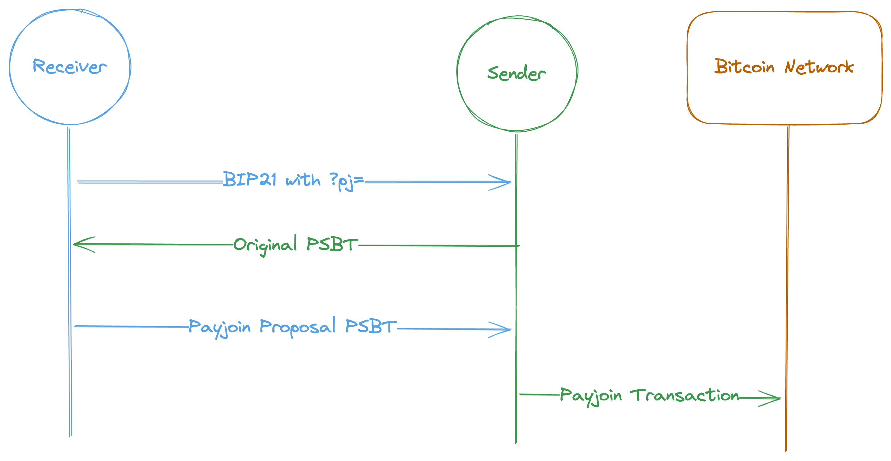

:::warning

This version will be deprecated in favor in [Payjoin v2](./v2.md). However, everything defined here is backward-compatible and relevant to v2, so read on!

:::

### Motivation

The initial payjoin specification as defined in [BIP 78](https://github.com/bitcoin/bips/blob/master/bip-0078.mediawiki) was designed to solve 2 problems for the sender (Alice) and receiver (Bob) of a given transaction:

- The receiver misses an opportunity to **consolidate UTXOs** or **make a payment**.
- The sender has privacy leaks due to heuristics about typical transactions.

In most scenarios today, the sender signs a transaction containing _only_ her UTXOs and broadcasts it to the network. This pattern has led to several heuristics used to erode the privacy of those in the transaction and the network:

- **Common input ownership heuristic**: The assumption that all inputs belong to the sender.
- **Change identification from scriptPubKey**: The assumption that if all inputs spend from the same [scriptPubKey](todo) type (P2SH, P2PKH, P2TR, etc), then the change output is likely to have the same scriptPubKey too (since all the inputs belong to the sender, the output with the matching scriptPubKey is likely also the sender's).
- **Change identification from round amount**: The assumption that the receiver gets the "round amount" (i.e. 0.3 instead of 0.354323...), since it's more natural for him to ask for payment in round amounts.

The idea was to allow the receiver to consolidate UTXOs and/or batch payments during the sender's transaction to them (saving fees), and for the sender to invalidate the three heuristics above.

Notably, payjoin transactions enhance the _efficiency_ of the network by reducing the number of transactions and the _privacy_ of the network by invalidating the reliability of the three heuristics used to track users.

As Adam Gibson has noted, if some relatively small uptick in payjoin usage was observed, it would cast doubt on _all_ transactions, [even for those who don't payjoin](https://reyify.com/blog/payjoin#:~:text=Now%2C%20here%27s%20the,a%20privacy%20advantage!).

### Protocol

BIP 78 defines the following steps for payjoin:

1. The receiver of the payment presents a [BIP 21 URI](https://github.com/bitcoin/bips/blob/master/bip-0021.mediawiki) to the sender with a parameter `pj=` describing a payjoin endpoint.
   - Example: `bitcoin:<BITCOIN-ADDRESS>?pj=<RECEIVER-PAYJOIN-ENDPOINT>`
2. The sender creates a signed, finalized PSBT with witness UTXO or previous transactions of the inputs. We call this PSBT the `original`.
3. The receiver replies back with a signed PSBT containing his own signed inputs/outputs and those of the sender. We call this PSBT `Payjoin proposal`.
4. The sender verifies the proposal, re-signs his inputs and broadcasts the transaction to the Bitcoin network. We call this transaction `Payjoin transaction`.

### BIP 21 Parameters

The spec defines a few BIP 21 parameters for payjoin:

- `pj=`: The receiver's http(s) endpoint which tells the sender where to POST the original PSBT to.
- `pjos=0`: Signal to the sender that they MUST disallow [output substitution](https://github.com/bitcoin/bips/blob/master/bip-0078.mediawiki#payment-output-substitution) (the receiver's ability the modify the outputs. This should be set on unsecured servers to disallow the possibility of the receiver's funds being stolen.

See the [full spec](https://github.com/bitcoin/bips/blob/master/bip-0078.mediawiki) for the full list of available parameters

### Drawbacks

One of the primary drawbacks of payjoin v1 is the requirement of a server for the receiver. This means that a) the funds received are kept in a hot wallet, and b) the server must be online at the time of payment receipt, which in practice means the server will likely need to be always-online. While this is probably fine for businesses, this is a significant barrier to individuals using payjoin. Thankfully, we can do better.

### Next Steps

Check out [BIP 78](https://github.com/bitcoin/bips/blob/master/bip-0078.mediawiki) to see the full payjoin v1 spec. In the next section, we'll learn how payjoin can be made _serverless_ and _asynchronous_ in version 2.
