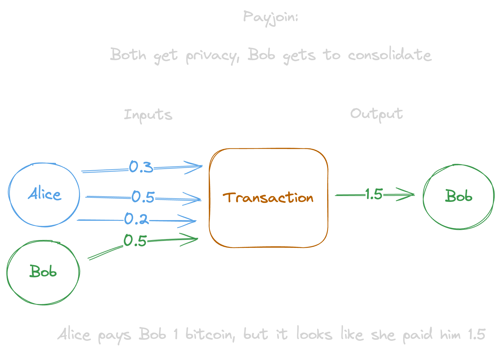

# Introduction

Payjoin is a protocol for creating collaborative transactions between a sender (Alice) and a receiver (Bob). It is simple, requires no changes to bitcoin, can operate without any manual interaction from the user, and has a variety of benefits and use cases, including:

- **Privacy**
- **Cost & Time Savings**
- **Scaling**
- **Flexibility & Extensibility**

In a typical on-chain bitcoin transaction, all of the [UTXOs](https://unchained.com/blog/what-is-a-utxo-bitcoin/) would belong to Alice. After all, one might ask, what sense does it make for Bob to send bitcoin to himself? It is _assumed_ that the spender in a transaction is the one who owns every UTXO:

This assumption is called the [common-input-ownership heuristic](<[todo](https://en.bitcoin.it/wiki/Common-input-ownership_heuristic)>), and even Satoshi declared it the last unsolved privacy problem in the [whitepaper](https://bitcoin.org/bitcoin.pdf). But it wasn't unsolved, just undiscovered. Because the common-input-ownership heuristic is not required, a transaction can be constructed with any number of participants spending to anyone, including to themselves. One such combination is a [coinjoin](https://en.bitcoin.it/wiki/CoinJoin), whose primary purpose is for the participants to collaboratively construct transactions to themselves to gain privacy. But it comes at the cost of paying high fees and requires high user interaction.

Payjoin is a different combination, which uses both sender and receiver UTXOs:

### Privacy

Payjoin also breaks the common-input-ownership heuristic, which is the primary metric used by creepy blockchain analysis companies trying to spy on your financial life. In this way, it restores and re-normalizes privacy as a fundamental human right back to the common individual, breaking the mold of difficult to use, expensive, centralized coinjoin coordinators which can invite bad actors <!-- include this last part??? -->. With payjoin, privacy best practices can be seamlessly integrated into the wallet experience, it is not a requirement that the user be aware they are conducting a payjoin. Privacy is easy if it's obtained by _default_.

### Cost & Time Savings

Payjoin can save money and time by batching transactions when fees are low. Most wallets default to [address reuse](https://en.bitcoin.it/wiki/Address_reuse) (as they should!). This however results in more UTXOs when spending a transaction. Since the scarce resource in Bitcoin is block space, the [fee](https://unchained.com/blog/bitcoin-transaction-fees/) paid (in satoshis) in a transaction is measured relative to the number of bytes in the transaction, i.e. satoshis per byte or [satoshis per virtual byte](https://bitcoin.stackexchange.com/questions/89385/is-there-a-difference-between-bytes-and-virtual-bytes-vbytes)). So if you have many small UTXOs, you're likely to have to combine some to make larger payments, which results in higher fees. Therefore, you should periodically [consolidate UTXOs](https://unchained.com/blog/too-many-bitcoin-utxos/) by sending them to a new address you own when fees are low.

Payjoin performs a consolidation on _every_ payment. While wallets today make this a manual, interactive experience, this can easily be the default for wallets that integrate payjoin. Bitcoin users wouldn't have to worry about taking this extra step as it can be automated for them.

Payjoin can also save time in Lightning Network channel opens by turning the two step process of creating and funding a lightning node [into one step](https://brandonlucas.net/articles/bitcoin/payjoin#:~:text=Lightning%20and%20Payjoin%3A%20A%20Perfect%20Match).

### Scaling

As stated above, payjoin's ability to negotiate the combination of UTXOs during transaction creation allows for opportunistic consolidation when fees are low. But it also allows for multiple transactions to be performed at once. In applicable scenarios (such as in simultaneously funding a lightning node and opening channels), any number of spends can be conducted with only a single on-chain transaction footprint. If you know you have to make a payment to multiple parties, why not just do it in one transaction and save on fees?

### Flexibility & Extensibility

Because payjoin utilizes [BIP 21](https://bitcoinqr.dev/) payment URIs, parameters related and unrelated to payjoin can be used and understood by wallets. The use of BIP 21 allows wallets that don't support payjoin to fallback to regular transactions, allows for the configuration of the many [payjoin-specific parameters](https://github.com/bitcoin/bips/blob/master/bip-0078.mediawiki#bip21-payjoin-parameters), as well as parameters outside the payjoin protocol or ones yet-to-be created.

### Next Steps

Payjoin allows for automated enhancements to on-chain bitcoin that users currently have to expend a great deal of time and money to achieve. It upgrades bitcoin transactions from being laborious, costly, and traceable to being automated, efficient, and private. No soft forks required.

Keep going to learn more about how payjoin works and its potential applications!
