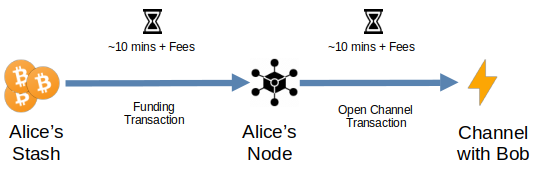
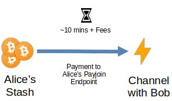

# How Payjoin Improves Lightning

The Lightning Network (LN) is a second-layer solution built on Bitcoin that takes transactions off-chain to allow for near-instant, final settlements with far lower fees, tremendously increasing transaction throughput, improving privacy, and allowing for new use cases for Bitcoin such as micropayments. It uses a network of payment channels between nodes to route payments from source to destination. These channels require node operators to lock up “liquidity” (bitcoin that can flow between one node and its channel partner) between their channel partners. How much bitcoin you can spend in a channel is limited by how much liquidity exists on your side of that channel.

Setting up and managing liquidity in a Lightning Node can be cumbersome and expensive. Transactions can't be sent immediately after the node has synced with the blockchain. You first have to conduct a two-step process of funding the node's on-chain wallet and then opening a channel with another node, which involves constructing another on-chain transaction to lock up the funds between you and your channel partner. This is a two-step process of funding the node, waiting for at least one confirmation (~10 minutes), then sending a channel open transaction and waiting another ~10 minutes, paying two fees along the way. This is unnecessarily slow and expensive. The node operator will likely want to open multiple channels to help ensure against routing failures and to increase liquidity, making this a repeat process.

Many other technical difficulties in setting up a node can be abstracted away for end users, but liquidity requirements remain a challenge for all self-custodial nodes. In fact, there is [estimated](https://river.com/learn/files/river-lightning-report-2023.pdf) to be 1 non-custodial user for every 8 custodial users, simply due to the challenges of self-custodial user interfaces — liquidity issues being one of the primary setbacks.

## With Payjoin, We Can Do Better
Payjoin can simplify this process, saving both money and time by allowing the node operator to do both the funding and the opening transaction at once. Instead of having to wait for two transactions to confirm to open one channel, they can wait for one transaction to confirm for as many channels as they'd like, provided they have sufficient funds. Since Payjoin can create transactions with multiple UTXOs, it can effectively batch transactions and open multiple channels at once.

Payjoin also preserves privacy by removing the on-chain footprint (the size of your channels and who you open channels with) normally left by lightning channels. A transaction sent over a lightning channel opened via a Payjoin transaction has far greater privacy than a normal on-chain transaction.

In summary, Payjoin makes channel opens **simpler** because users now only have to make one transaction instead of two, **faster** because they only have to wait for one transaction to be confirmed, and **cheaper** because they only have to pay one fee.